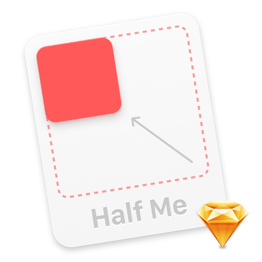

# Half Me

Sketch plugin that just scales selected layer to 50% (⇧⌘K).

### Install

1. Download and unzip: [half-me-sketch-master.zip].
2. Open Sketch.app, go to `Plugins → Reveal Plugins Folder...` and place `Half-Me.sketchplugin` there.

[half-me-sketch-master.zip]: https://github.com/romashamin/half-me-sketch/archive/master.zip

### System Requirements

Compo has been tested on Sketch 3.7.2 on OS X Yosemite. If you have any problems, drop me a line: [@romanshamin].

[@romanshamin]: https://twitter.com/romanshamin

### Satisfied Pro?

If you’re a professional web designer or a developer and Half Me saves your time, buy me an espresso to say ‘thanks’: [pay $3 by PayPal].

[pay $3 by PayPal]: https://www.paypal.me/romanshamin/3

### Thanks

